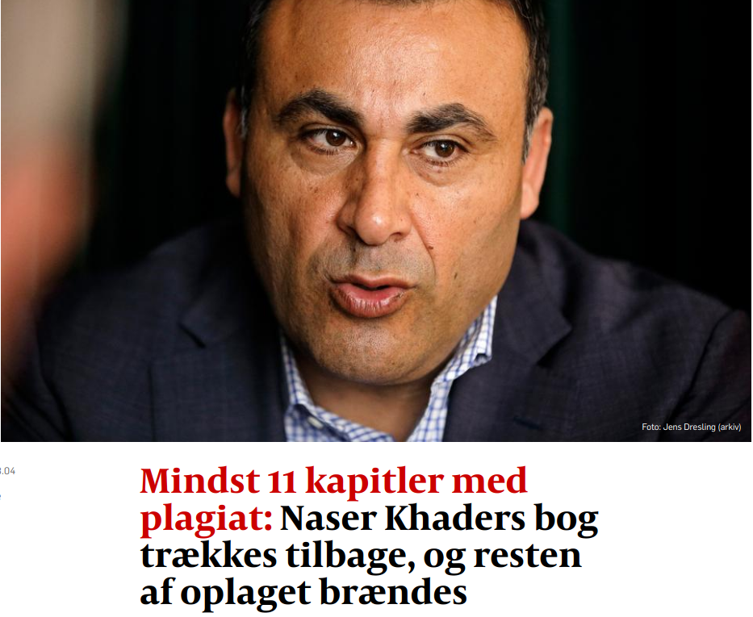
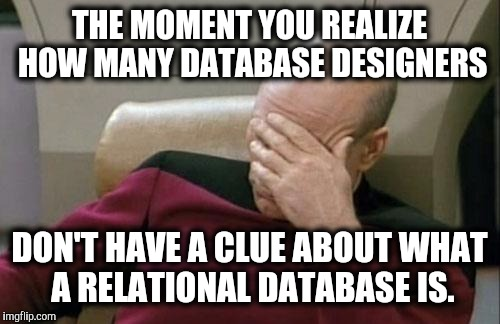
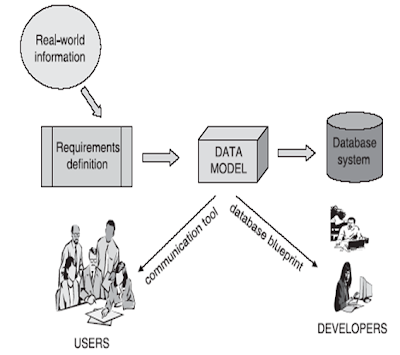
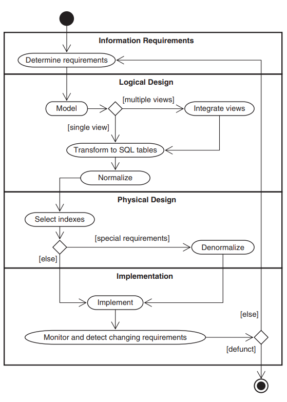
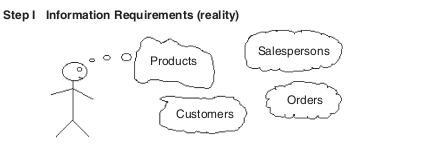
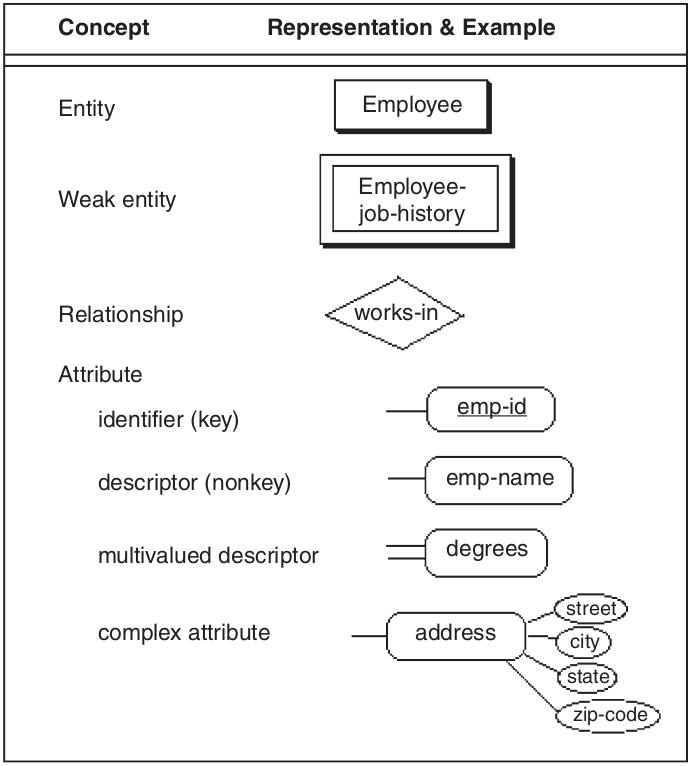
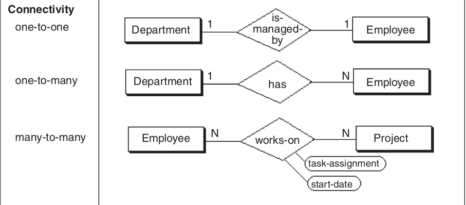
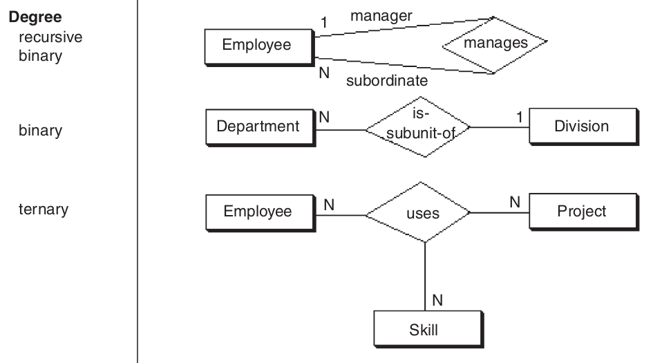
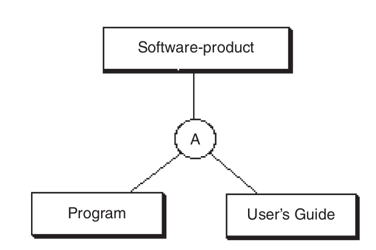
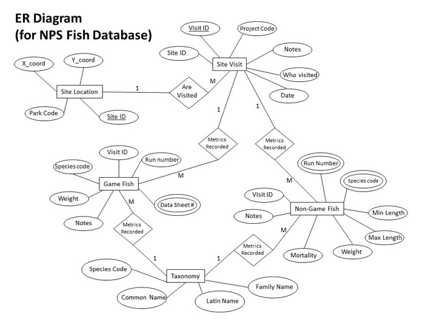

<!-- .slide: data-background="#003d73" -->

## I4DAB

### Introduction 

 <!-- .element style="width: 200px; position: fixed; bottom: 50px; left: 50px" -->


----

<!-- .slide: style="font-size:32px" -->

### Qualifications

* <span style="color: red">Summarize</span> methods for selection and modeling of a concrete database technology.
* <span style="color: red">Compare</span> data structures in databases with data structures in an application.
* <span style="color: red">Applying</span> standard network technologies to provide network access to a given database.
* <span style="color: red">Analyze</span> techniques to ensure correct data in a database and for sharing the responsibility for correct data between databases and applications.
* <span style="color: red">Applying</span> different types of databases related to application development with help from development tools and programming methods.
* <span style="color: red">Describe</span> the most common database subject expressions.

----

### Examination

* Assessment: Passed/Failed
* 3 assignments + 1-3 review - all must be approved
* Assignment are graded on Brightspace
    * 2: Passed
    * 1: Passed with comments
    * 0: Failed - resubmit
* Review, BB score 1 approved, 0 not approved.
* Assignment should be handed in before deadline to be graded

----

### Plagiarism

 <!-- .element: style="height: 400px" -->

Read more: [https://library.au.dk/studerende/plagiering/](https://library.au.dk/studerende/plagiering/)

----

### Schedule

TODO Insert:

----

### Course Form

* Lectures (Theory, code examples, live coding, exercises)
* 3 mandatory exercises (hand-in)
    * Have to be approved!
* 1-3 Peer review
    * Have to be approved!
* Curriculum
    * Database Modeling and Design - 5th edition
    * MongoDB Applied Design
    * Online articles / documentation

---

### Your expectations

? 

----

### Our expectations

* Read material before class
* You solve exercises - and there will be exercises to do out of class
* Help each other
* Ask if we should talk about previous exercises


---

### Intro

#### Relational Model



----

### Agenda

* Database
* Relational model
* SQL (more in week 2, 3, and 4)
* Modeling
* Process
* Entity Relationship Diagrams (ER/D)

---

### Database

* Database is an abstractions on a filesystem, which allow common operations on data
* Database server
    * Allow multiple simultaneous clients to do
    * Create Read Update and Delete operations: AKA CRUD
    * Access over network
    * Can be spread on multiple hosts
    * And maybe the most important topic: allow data oriented access to the file/files

----

### Database server

* Where and when is it running
* SQL Server:
    * when the docker container is running
    * when windows server is running
    * when localDB is running
* SQLite:
    * when the sqlite.exe is executing
* MongoDb:
    * when the docker container is running
    * when windows services running
    * when mongodb.exe is executing

----

### Data model 

* Structure of the data
    * Operations on the data
    * Queries and modifications
* Constraints on the data

----

#### Data Model In Our Context 1

* Do we already know something?
    * Yes, because we are doing domain models and class models when doing OO-A and -D
    * To construct a database we need a data model looking for entities
    * Diffence between object and entity? In short! Object = data + behavior; Entity = data; (a definiton to start with!!)

----

#### Data Model In Our Context 2

* Automatization
    * For a relational database, this model is very often a Entity Relationship Diagram model (ERD model)
    * In a ERD model we identifies entities and their relationships, ie nouns and verbs in user stories/use cases
    * For all relationships, AKA associations, we identifies their degree, connectivity and exsistience


----

#### Data Model In Our Context 3

* Automatization
    * When we have a ERD model we know exactly how to construct the database with tables and relationships
    * Ten design rules transforms the ERD model to a relational database (rdb) schema
    * Giving the possibillities to let db-tools convert an ERD to a rdb schema
    * But as you will se later on, the same goes for an OO class model, it can be converted to a rdb schema

----

### Data model

* Relational model vs semi-structure model
* Values
* Objects

```xml
<Movies>
  <Movie title="Star Wars"><Year>1977</Year><Length>124</Length><Genre>SciFi</Genre></Movie>
  <Movie title="Ghost"><Year>1990</Year><Length>127</Length><Genre>Drama</Genre></Movie>
  <Movie title="Skyfall"><Year>2012</Year><Length>143</Length><Genre>Action</Genre></Movie>
</Movies>
```
<!-- .element: style="font-size: 12px" -->

```javascript
[
    { title: "Star Wars", year: 1977, length: 124, genre: "SciFy"}, 
    { title: "Ghost", year: 1990, length: 127, genre: "Drama"}, 
    { title: "Skyfall", year: 2012, length: 143, genre: "Action"}, 
]
```
<!-- .element: style="font-size: 12px" -->

----

### Structured data


| Title     | Year | Length | Genre  |
|-----------|------|--------|--------|
| Star Wars | 1977 | 124    | SciFy  |
| Ghost     | 1990 | 127    | Drama  |
| Skyfall   | 2012 | 143    | Action |


---

## Relational model

"Data dominates. If you've chosen the
right data structures and organized
things well, the algorithms will almost
always be self-evident. Data structures,
not algorithms, are central to
programming." - Rob Pike in 1989

----

### Basic

* Relation (Two-dimensional table)
    * Row represent an entity (object)
    * Column represent an attribute (property)
* Attributes
    * Must be **atomic**, eg. int, string, ...
* Schema
* Tuples

| Title     | Year | Length | Genre  |
|-----------|------|--------|--------|
| Star Wars | 1977 | 124    | SciFy  |
| Ghost     | 1990 | 127    | Drama  |
| Skyfall   | 2012 | 143    | Action |
<!-- .element: class="fragment" style="font-size: 22px" -->

----

### Representation of Relations
* Relations are Set<Tuple>
    * Order of rows and columns are not significant
* Relations are not static
    * Addition, modifications, deletion
    * Less common, changes to schema


----

### Keys

* Fundamental constraint
* A set of attributes forms a key iff. we do not allow two tuples to have the same values in all key attributes
    * Eg. Movies(title, year, length, genre)
* Keys can be generated
* Key constraints is a statement for all possible instances of the relation

----

### Schema

```sql
Movies (
  title: string, year: integer, length: integer, genre: string, studioName: string
)
MovieStar (
  name: string, address: string, gender: char
)
Studio (
  name: string, address: string, pressC: integer
)
```

-----

### Sql

* Data-Definition sub-language
    * Declaring database structures
    * Declaring database constraints
* Data-Manipulation sub-language
    * Querying database for content
    * Modifying database content

```sql
CREATE TABLE
Movies (
  title CHAR(100),
  year INT,
  length INT,
  genre CHAR(20)
)
---
SELECT title FROM Movies ORDER BY year
```

TODO: Check sql server syntax

----

### Relations in SQL

* Stored relations
    * Tables
    * Views
        * Relations defined by computation
        * Not stored but constructed when needed
    * Temporary tables
        * Constructed by SQL processor
        * Constructed as part of queries and data modification
        * Thrown away after

---

## Simple table definition

"Fold knowledge into data, so program
logic can be stupid and robust." - Eric Raymond

----

### Data types

TODO: SQL SERver data types

* Strings: CHAR(n) and VARCHAR(n)
* Bit: BIT(n) and BIT VARYING(n)
* BOOLEAN
* Numbers: INT, SHORT INT
* Floating point numbers: FLOAT, REAL and DOUBLE
* Time: DATE and TIME

**Note**: Differs from SQL engine to engine.

----

```sql
CREATE TABLE Movies (
    title CHAR(100), year INT, length INT, genre CHAR(20)
)
SELECT title FROM Movies ORDER BY year
ALTER TABLE Movies ADD studioName CHAR(30))
DROP TABLE Movies
CREATE TABLE Movies (
  title CHAR(100), year INT, length INT, genre CHAR(20),
  UNIQUE KEY (title, year)
)
CREATE TABLE Movies (
  title CHAR(100), year INT, length INT,
  genre CHAR(20) DEFAULT ‘UNKNOWN’,
)
```
<!-- .element: style="font-size: 12px" -->

TODO: Syntax


---

## Modeling

#### Entity Relationship Diagram



----

### Why

* Create model before system to avoid expensive changes
* Simplify real world problems to create a simple relational model
* Communicate design between developers and / or customer(s)

----

### What

* Domain rules and business rules
* Data structures and object structures
* Not procresses

----

### How

* Design interaction between application and database
* Optional: Use an Object Relational Mapper

---

### Process

* Requirements
* Logical design
* Physical design

----

<!-- .element: style="height:600px" -->

----

### Requirements

* From producers and consumers of data
* Must include
    *  Data
    * Relationship between data


 <!-- .element: style="height:200px" -->

----

### Logical design (1/2)

* Schema showing all data and relationships between entities
* Can be done in Entity-Relationship (E/R) or Unified Modeling Language (UML)
* **Goal**: Model that can be transferred into database tables

----

### Logical design (2/2)

* Conceptual data modeling
    * Typically modeled by E/R and UML
    * Relationships, super-types etc.
* View integration
    * Normally necessary in large projects
    * Eliminate inconsistencies and redundancies
    * E.g. find synonyms, aggregate and generalize
* Transform to SQL (covered in week 2-3)
* Normalize tables

---

## Entity relationship diagrams
#### Chen notation

----

### Components

* Entities: principle data objects
    * Key uniquely identifies occurrence
* Weak entities
    * Connected to parent - cannot exists without
* Relationship
    * Associations between entities
* Attributes
    * Multivalued: Multiple values
    * Complex: Attribute contains more information

----

 <!-- .element: style="height:600px" -->


----

### Relationship (1/3)

* No standard for connectivity
* One 2one
    * Mapped with attributes
* One 2 many
    * Mapped with attributes
* Many 2 many
    * relationship table/connection entity – can have attributes associated
* Constraints on numbers (cardinality) are possible

----

<!-- .element: style="height:500px" -->


----

### Relationship (2/3)

* Binary
    * Most common
* Binary Recursive
    * Relationship between entities of same type
* Ternary - in a moment
* Higher degree
    * Not used

----

 <!-- .element: style="height:500px" -->

----

### Ternary relationship (1/4)

* **Should**  be used when binary relationships are not sufficient
* A 'one' relationship iff. one instance is associated with one of each of the two other
* else 'many'


----

### Ternary relationship (2/4)

* **Assertion 1**:
    * Relationship is one to one to one
    * Technician can work on multiple project – having different notebooks for each


----

### Ternary relationship (3/4)

* **Assertion 2**:
    * Employee works on one project in one location. Can be in different locations depending on project
    * At a location there can be multiple employees on a given project.


----

### Ternary relationship (4/4)

* **Assertion 3**:
    * A manager of a project manages multiple engineers
    * Manager of an engineer can manage multiple projects
    * Engineer working under a manager can work on multiple projects


----

### Relationship (3/3)

* Optional
    * Minimum of zero
* Mandatory
    * Minimum of one
* Existence is often inferred
    * E.g. weak entities can't have optional relationship to parent.

----

 <!-- .element: style="height:300px" -->

----

### Generalization / Inheritence

* Disjoint
    * Requires mutually exclusiveness in sup-types
* Overlapping
    * Total or partial covered
    * Total -> double line

  <!-- .element: style="float: right; height:300px" -->

----

### Aggregation

* Part-of relationship
* Seldom used
* No inherited attributes

  <!-- .element: style="float: right; height:200px" -->

----

### E/R Example




---

### References,

* Frontpage image: http://www.etltechblog.com/2012/09/part-1-data-modeling-overview.html
* Example ER: https://jameseckertgis590ncstate.weebly.com/e-r-diagram.html
* Figures from Database modeling and Design, Fifth edition Logical design