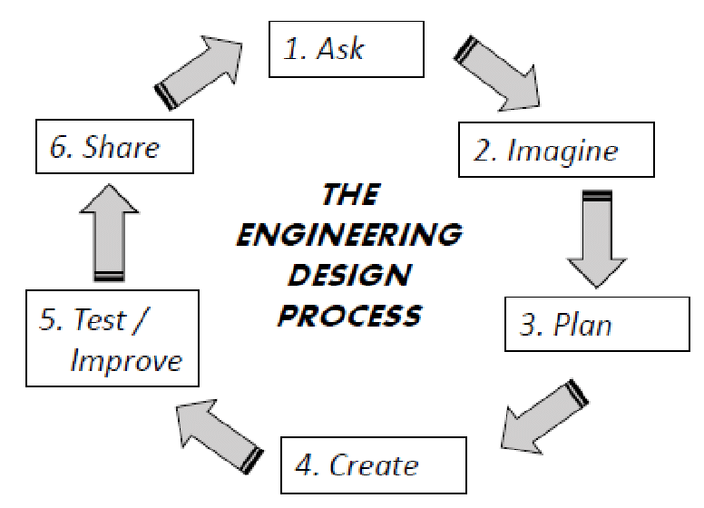
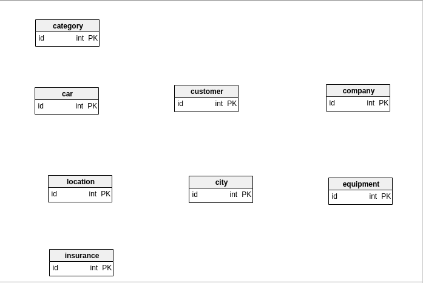
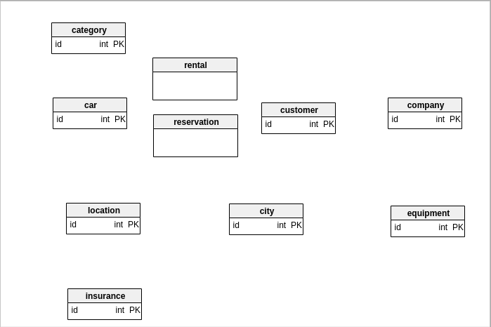
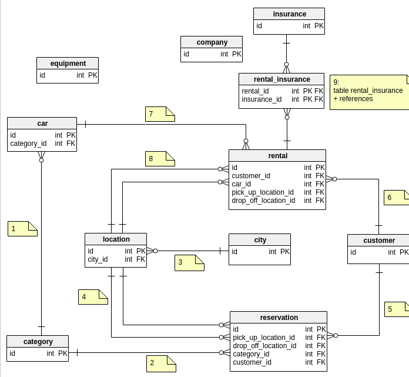
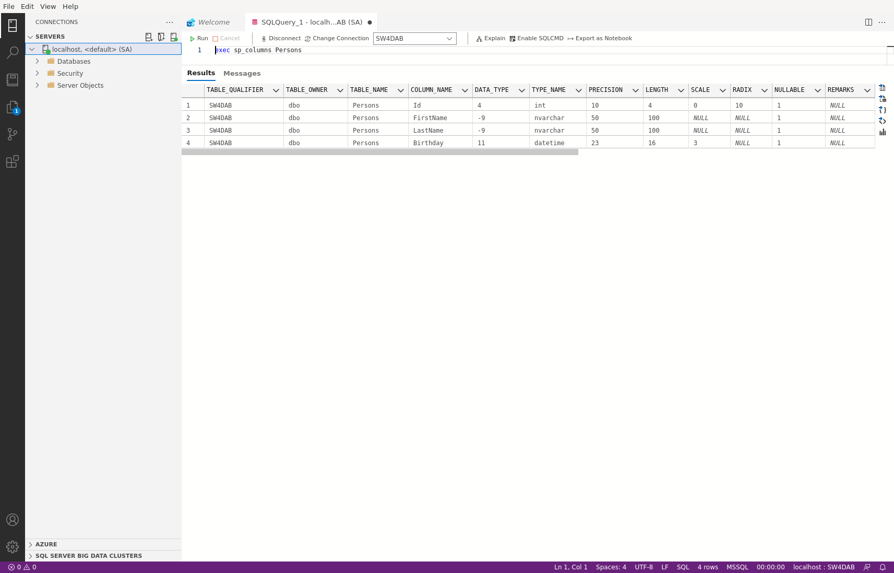

<!-- .slide: data-background="#003d73" -->

## Modeling

#### Design principles to Schema


 <!-- .element style="width: 200px; position: fixed; bottom: 50px; left: 50px" -->


----

### Agenda


---

### Requirements

* Time and labor consuming
* Knowledge from end users of database
    * Outline requirements for basis elements
    * Describe information about elements and relationship
    * Determine transactions
    * Define non-functional requirements
    * Specify technical constraints
* Should result in system description

----

<!-- .slide: style="font-size: 20px; text-align: left" -->

### Project description

A car rental company rents cars to customers. The company owns several cars. Each car has a brand, model name, production year, mileage, color, and so on. Cars are divided into different categories: small, mid-size, large, limousines.

The company has many locations where you can rent a car. The rental locations are located in different cities throughout the country. There can be more than one company location in a city.

Anyone over 21 who has a valid driver's license can rent a car. Customers under 25 or over 75 years pay different (higher) charges then other customers.

Before renting a car, a customer usually makes a reservation for a car. A customer specifies the dates when the car will be rented, the pick-up location, the drop-off location, and the category of car he wants to rent. A customer may specify, that he wants some extra equipment in the car, for example a GPS, a car seat for a child, etc.

When a customer rents a car, he declares the pick-up and drop-off location, and the drop-off date. The customer can buy various types of insurance. He can also decide that he doesn't need insurance because the insurance is covered otherwise, for example by his credit card company. The customer can choose additional options such as the possibility of an early drop-off, various refueling options, etc.

The customer pays the charges when he returns the car.

---

### Design Process

 <!-- .element: style="height: 500px"-->

----

### 1. Entities and attributes

* Find entities and attributes from project description
    * Entity should contain descriptive information
    * Multivalued attributes should be modeled as entities
    * Attributes are properties associated with primary entity
    * Attributes should be attached to 'most relevant' entity
* Not only real world objects

----

<!-- .slide: style="font-size: 28px; text-align: left" -->
### Nouns


A **car** rental **company** rents **cars** to **customers**. The **company** owns several **cars**. Each **car** has a **brand**, **model name**, **production year**, **mileage**, **color**, and so on. **Cars** are divided into different **categories**: small, mid-size, large, limousines.

The **company** has many **locations** where you can rent a **car**. The rental **locations** are located in different **cities** throughout the **country**. There can be more than one **company** **location** in a **city**.

Anyone over 21 who has a valid **driver's license** can rent a **car**. **Customers** under 25 or over 75 years pay different (higher) **charges** then other **customers**.

Before renting a car, a customer usually makes a **reservation** for a car. 
....

----

### First take on entities

 <!-- .element: style="height: 500px"-->


----

### 2. Test/Improve (Evaluate)

<!-- .slide: style="font-size: 28px; text-align: left" -->
### Nouns


A **car** rental **company** rents **cars** to **customers**. The **company** owns several **cars**. Each **car** has a **brand**, **model name**, **production year**, **mileage**, **color**, and so on. **Cars** are divided into different **categories**: small, mid-size, large, limousines.

The **company** has many **locations** where you can rent a **car**. The rental **locations** are located in different **cities** throughout the **country**. There can be more than one **company** **location** in a **city**.

Anyone over 21 who has a valid **driver's license** can rent a **car**. **Customers** under 25 or over 75 years pay different (higher) **charges** then other **customers**.

Before renting a car, a customer usually makes a **reservation** for a car. 
....


----

### Second take on entities

 <!-- .element: style="height: 500px"-->

----

### 3. Relationships

* Determine relationship from project description
* Determine
    * relationship degree
    * connectivity
    * existence (optional / mandatory)
    * attributes associated with relationship
* Make sure not to introduces redundant relationship
* More relationship can exists between entities

----

<!-- .slide: style="font-size: 28px; text-align: left" -->
### Relationships elicitation


1. Each car belongs to a category,
2. Each reservation is for a category of cars,
3. Each location is in a city,
4. Each reservation has a pick up and a drop off location,
5. Each reservation is made by a customer,
6. Each rental is made by a customer,
7. Each rental is for a certain car,
8. Each rental has a pick up and a drop off location.
9. Each rental is connected to some insurance...


----


### Relationship example

<!-- .element: style="height: 500px"-->

----

### 4. Exemplify

* Given our entities, attributes and relationship
    * Add example data
* Design is **iterative**
    * So compare schema with description
    * Do not make assumptions
    * Ask questions
* There is not one correct design

----

### 5. Schema validation

1. Identifying conflicts in schema
    1. Synonyms / homonyms
    2. Structural conflicts
    3. Keys
    4. Dependencies
2. Conformation of schema
3. Merging and restructuring
    1. Completeness
    1. Minimality
    1. Understandability

 <!-- .element: class="fragment" style="position: absolute; top: 150px; right: 0px; height: 300px" -->

---

### Design Principles 1/2

* Faithfulness
    * Design should be faithful to specifications
    * Attributes should reflect reality
* Avoid redundancies
    * Try to model things only once
    * Same truth in multiple places leads to
        * Updates in multiple places
        * Unnecessary space used

----

### Design Principles 2/2

* Simplicity
    * Do not introduce more elements than needed
* Choosing right relationships
    * Entity can be connected in various ways - only add needed relationships
* Element types
    * Use attributes when this makes sense etc.
    * Attributes are simpler to implement than entities

---

### DML

----

### CREATE DATABASE

* Create a database
    * `CREATE DATABASE SW4DAB`
* Select a database
    * `USE SW4DAB`
* Show databases on server
```sql
SELECT name FROM sys.Databases
 ------------------------------
master
tempdb
model
msdb
SW4DAB
```
* **Note**: SQL Server is not case sensitive

----

### CREATE tables

* Create tables
```sql
CREATE TABLE Persons (Id INT, FirstName NVARCHAR(50),
  LastName NVARCHAR(50), Birthday DATETIME)
```
* Show tables in selected database
```sql
SELECT TABLE_NAME
FROM SW4DAB.INFORMATION_SCHEMA.TABLES
WHERE TABLE_TYPE = 'BASE TABLE'
```
* **Note**: Strings are case-sensitive
* **Note**: Create NVARCHAR without size paramater -> NVARCHAR(1)

----

### Details about a existing table

```sql
exec sp_columns Persons
```



---

### Data types

* [SQL Server 2019 datatypes](https://docs.microsoft.com/en-us/sql/t-sql/data-types/data-types-transact-sql?view=sql-server-ver15&viewFallbackFrom=sql-server-2019)
* Numbers:
    * Bigint, Int, Decimal, Money, Float, Real,...
* DateTime:
    * Date, DateTime2, DateTimeOffset, Time
* Text:
    * Char, Text, Varchar, NChar, NVarChar, NText
* Binary:
    * Binary, VarBinary, Image

---

### Constraint (1/2)

* Primary key constraint
```sql
CREATE TABLE Students (
    Id INT PRIMARY KEY,
    FirstName NVARCHAR(32),
    LastNAme NVARCHAR(32),
    AuId NVARCHAR(20)
)
```
* Check column value constraint
```sql
CREATE TABLE Teachers(
    Id INT PRIMARY KEY,
    Name NVARCHAR(128),
    Age Int, CHECK(Age >= 18)
)
```

----

### Constraint (2/2)

* Default value constraints
```sql
CREATE TABLE Orders (
    Id INT NOT NULL,
    OrderNumber INT NOT NULL,
    OrderDate DATE DEFAULT GETDATE()
)
```
* Foreign key constraint
```sql
CREATE TABLE Assignments (
    Id INT PRIMARY KEY
    Name VARCHAR(20),
    Body TEXT,
    StudentId INT FOREIGN KEY REFERENCES Student(id)
)
```
* **Note**: Inline foregn key above, also possible to declare constraints after attributes

----

###  Referential integrity

* The default policy
    * Reject violating modifications
* Deletion 
```sql
ON DELETE CASCADE
```
* Update
    * Changes are mimicked in the foreign key
```sql
ON UPDATE CASCADE
```
    * Modification to referenced relation, foreign key are change to null
```sql
ON UPDATE SET NULL
```

TODO: maybe include an example <!-- .element: style="visibility: hidden" -->

----

### Auto values

* Auto increment
```sql
CREATE TABLES Goods (
    Id INT IDENTITY(1,1) PRIMARY KEY,
    NAME VARCHAR(128)
)
```
* Identity(1,1), starts at 1 and increment by 1
* Identity(10,2), starts with 10 and increment by 2

---

### Alter table (1/2)

* Add attribute to existing table
```sql
ALTER TABLE Orders
ADD Price INT DEFAULT 0
```
* Add constraint to existing table
```sql
ALTER TABLE Persons
 -- or
ALTER COLUMN Id INT NOT NULL
```

----

### Alter table (2/2)

* Remove existing constraint
```sql
ALTER TABLE Teachers
DROP CONSTRAINT CK_Teachers__Age__324D4AFE
```
* Remove attribute existing table
```sql
ALTER TABLE Teachers
DROP COLUMN Age
```
* **Note**: Connot drop columns with constraints, constraints needs to be removed first

----

### Changing

* Change column name
* Copy columns between tables
* Change column order
* ...

----

### Deleting
 
#### Delete tables   

```sql
DROP TABLE Teachers
```
#### Delete database

```sql
DROP DATABASE SW4DAB
```

---

## Quick intro to DDL

----

### Inserting

* Insertion
    * All values
```sql
INSERT INTO Student VALUES
(1, "Alice", "A.", "AU123456"), (2, "Bob", "B.", "AU234567")
```
    * Some values
```sql
INSERT INTO Orders (Id, OrderNumber)
VALUES (1,12345), (2, 23456)
```
* Constaint conflicts

```sql
INSERT INTO Assignments VALUES (1, 'I4dab', 'EfCore ...', 45)
-- The INSERT statement conflicted with the FORIGN KEY constraint 'FK__assignment__student_12314a'.
```

----

### Update / Delete data

* Update row(s) in a table
```sql
UPDATE Students
SET LastName = 'Larsen'
WHERE id = 2
```
* Delete row(s) from table
```sql
DELETE FROM Students
WHERE Id = 1
```

---

### References

* Design process](https://www.researchgate.net/figure/Steps-of-the-Engineering-Design-Process_fig1_333998494)
* [Frontpage meme](https://dilbert.com/strip/1996-02-28)