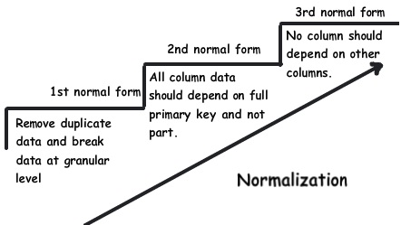
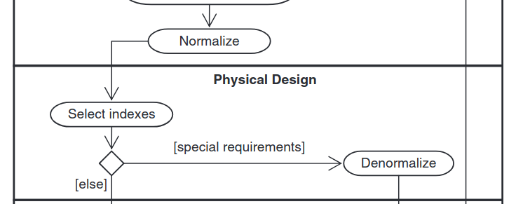

<!-- .slide: data-background="#003d73" -->

## Normalization

 <!-- .element style="width: 200px; position: fixed; bottom: 50px; left: 50px" -->

----

### Agenda

* Why Normalize
* Functional Dependency
* Normal forms
* What to do

---

## Anomalies

* **Redundancy**  Information may be repeated unnecessarily in several tubles
* **Update anomalies** We change information in one tuble, but the same information is left in another tuble
* **Deletion anomalies** If we delete data we may lose information as a side effect

----

| title              | year | length | genre  | studio    | starName      |
|--------------------|------|--------|--------|-----------|---------------|
| Star Wars          | 1977 | 124    | scifi  | Fox       | Carrie Fisher |
| Star Wars          | 1977 | 124    | scifi  | Fox       | Mark Hamil    |
| Star Wars          | 1977 | 124    | scifi  | Fox       | Harrison Ford |
| Gone with the Wind | 1939 | 231    | drama  | MGM       | Vivien Leigh  |
| Wayne's World      | 1992 | 95     | comedy | Paramount | Dana Carvey   |
| Wayne's World      | 1992 | 95     | comedy | Paramount | Mike Meyers   |
<!-- .element: style="font-size: 32px" -->

---

## Functional dependency

If two tuples of R agree on all attributes $ a_1, a_2, \ldots a_n $ , then they must also agree on another list of attributes $ b_1, b_2, \ldots b_n $

Formally 

$$ a_1, a_2, \ldots a_n \rightarrow b_1, b_2, \ldots b_n $$

Reads: $ a_1, a_2, \ldots a_n $  functional determines $ b_1, b_2, \ldots b_n $ <!-- .element: class="fragment" -->

----

### FD examples

Example:

**Movies1** (title, year, length, genre, studioName, starName)

* Claim 1: title, year $ \rightarrow $ length, genre, studioName<!-- .element: class="fragment" -->

* Claim 2: title, year $ \rightarrow $ starName <!-- .element: class="fragment" -->

note:
Claim1 = Expect that no movies with same title are made in the same year
Claim2 = False - more than one star for a particular movie

----

### Keys

We can say than $ 1\ldots n$ of attributes { $ a_1, a_2, \rightarrow a_n $ } is a key for a relation R if

1. These attributes functional determine all other attributes in R
2. No proper subset of { $ a_1, a_2, \rightarrow a_n $ } functional determines all other attributes in R 
Example: 
Attributes: `(title, year, starName)` forms a key for `Movies1`
      

note: 
1) Two distinct tubles can’t agree on { a1 a2, ..., an}.
2) Key must be minimal.
Ex: Determines all other attributes, key is minimal.
Title, year - not a key.
Year, starName - not a key.
title, starName

----

### Multiple keys

A set of attributes that contains a key is called a superkey (superset of a key)

A relation can hold multiple superkeys

Example: 

`(title, year, starName)` and `(title, year, length, studioName, starName)` are both keys

note:
TODO: better explain superkey

----

### Decomposing Relations

To eliminate anomalies in relations, we can decompose them.
Given a relation $ R(a_1, a_2, \ldots a_n) $ we may decompose into two relations $ S( b_1, b_2, \ldots b_m)$ and $T( c_1, c_2, \ldots c_k)$ such that

1. { $ a_1, a_2, \ldots a_n $ } = { $ b_1, b_2, \ldots b_m$ } $ \cup$ { $c_1, c_2, \ldots c_k$ }
2. Attributes in S and T may overlap

----

### Example

`Movies1 (title, year, length, genre, studioName, starName)` 

can be decomposed into

`Movies2 (title, year, length, genre, studioName)`

and

`Stars (title, year, starName)`

---

## Normal forms

----

### Boyce-Codd Normal Form (BCNF)

Definition: 

* A relation R is in BCNF iff. whenever there is a nontrival FD $ a_1, a_2, \ldots a_n \rightarrow b_1, b_2, \ldots b_m $ for R it is the case that { $ a_1, a_2, \ldots a_n $ } is a superkey
* That is, the left side of every nontrivial FD must 
contain a superkey

----

* Example
    * **Movies1** is not in BCNF
    * **Movies2**, **Stars** is in BCNF
* **Note**: Sometimes decomposition into BCNF can end in situation where checking FD on the relations is not possible

note:
Movies1 is not in BCNF because FD exists

Title, year -> length, genre, studioName - which is not a key

----

### 1NF & 2NF

* 1NF 
A relation is in 1NF iff. each have only atomic values - each column have only one value for each row
* 2NF 
A relation is in 2NF iff. its in 1NF and every non-key attribute is fully dependent on a primary key. An attribute is fully dependent on a primary key if its on the right side of an FD for which the left side is either the primary key or something that can be derived from the primary key.

note:

1NF is upheld these days for "all" SQL servers.   Reason this exists is because SQL builds on Relational Algebra

----

## 3NF

A relation R is in the third normal form (3NF) if:

Whenever $ a_1, a_2, \ldots a_n \rightarrow b_1, b_2 \ldots b_m $ is a nontrivial FD, either

{ $ a_1, a_2, \ldots a_n $ } is a super key or
$ b_1, b_2 \ldots b_m $ not in A's are member of some key*

**Note**: Weaker than BCNF

\* an attribute that is a member of some key is called a prime.

note:
3NF:
- 2NF;
- Intet felt må være transitivt afhængigt af primærnøglen:

Hvis en tabel har felter, der er indbyrdes afhængige, og ikke er en del af primærnøglen, så skal én eller flere af disse felter flyttes over i en ny tabel sammen med en kopi af det tilbageblevne felt (som derved bliver fremmednøgle

---- 

"For each nontrival FD, either the left side is a superkey, or the right side consists of prime attributes only." - Database Systems the Complete book 2nd edition., 

---

### Examples (1/4)

* 1NF - take 1

----

* 1NF - take 2 
Book(__title__, __format__, author, authorNationality, price, pages, thickness, genreId, genreName, publisherId) 
Subject(__subjectId__, subjectName) 
Publisher(__publisherId__, Name, Country) 
Subject(__title__, __subjectId__) 

----

### Examples 2NF (2/4)

* Relations:  
Book(__title__, author, authorNationality, pages, thickness, genreId, genreName, publisherId) 
Price(__title__, __format__, price) 
Subject(__subjectId__, subjectName) 
Publisher(__publisherId__, Name, Country) 
Subject(__title__, __subjectId__) 

note:
All attributer there isn't part of a key, depends on _title_. But _price_ only depends on _format_

----

### Example 3NF (3/4)
 
* Relations:  
Book(__title__, author, authorNationality, pages, thickness, genreId, publisherId) 
Genre(__genreId__, genreName) 
Price(__title__, __format__, price) 
Subject(__subjectId__, subjectName) 
Publisher(__publisherId__, Name, Country) 
Subject(__title__, __subjectId__) 

note:

2NF + no transitive depencies

E.g. _genreId_ and _genreName_ both depend on primary key _title_

// TODO: 2NF + no transitive depencies <!-- .element: style="visibility: hidden" -->
// Eg GenreId and GenreName both depend on primary key Title <!-- .element: style="visibility: hidden" -->

----

### Examples BCNF  (4/4)

* Relations:  
Book(__title__, author, pages, thickness, genreId, publisherId) 
Author(__author__, nationality) 
Genre(__genreId__, genreName) 
Price(__title__, __format__, price) 
Subject(__subjectId__, subjectName) 
Publisher(__publisherId__, Name, Country) 
Subject(__title__, __subjectId__) 

note:

Non-triviel depency between Author and AuthorNationality

----

### 4NF

BCNF applied to MVD instead of FD

A relation R is in 4NF if whenever $ a_1, a_2, \ldots a_n \twoheadrightarrow b_1, b_2, \ldots b_n $

Is a nontrival MVD, {$ a_1, a_2, \ldots a_n $} is a super

----

### A multivalued dependency (MVD)

$ a_1, a_2, \ldots a_n \twoheadrightarrow b_1, b_2, \ldots b_n $

holds for a relation R if when we restrict ourselves to tubles of R that have particular values for each attribute in ($ a_1, a_2, \ldots, a_n $) then there is a set of values we find among the ($ b_1, b_2, \ldots, b_m $) is independent of the set of values we find among the attributes of R that is not in those sets.

----

### In practics

1. Analyse the potential for performance benefits before normalizing
    1. Storage usage
    1. Update time
    1. Query time
1. BCNF or 3NF is normally the table forms to strive for\*
1. If performance is compromised by normalization, try denormalizing

note:

\* "[The practical need for fourth normal form](https://doi.org/10.1145%2F135250.134515) by Margaret S. Wu states in astudy of forty organizational databases, over 20% contained one or more tables that violated 4NF while meeting all lower normal forms

----

