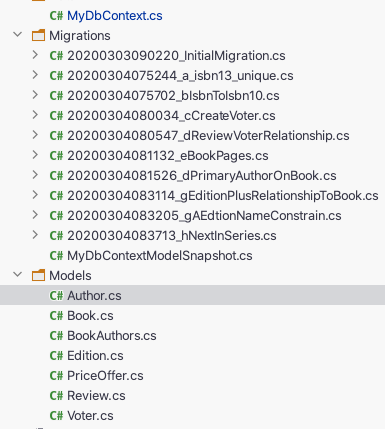
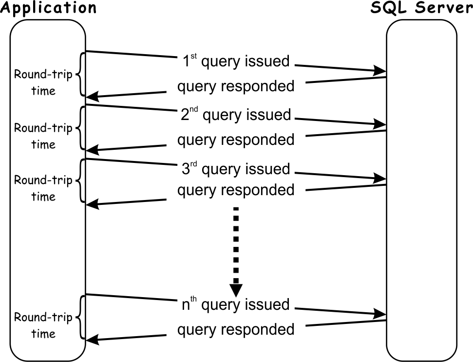

<!-- .slide: data-background="#003d73" -->
## EF Migrations

 <!-- .element style="width: 200px; position: fixed; bottom: 50px; left: 50px" -->

----

### Agenda

* Migration The why, what, where
    * First migration
    * Update database
    * Rolling back migrations
* Query
    * Loading strategies
    * Tracing
    * Create / Update

---

## SQLite vs SQL Server

* SQL Server localDb
  * Development database,
  * Almost same set of functions as SQL Server
* SQL Server
  * Full weight database
  * Connections string are non-trivial
  * -> So from now and onwards we will use this
* SQLite is very lightweight 
  * Can not remove columns only add
  * Mostly used for development / tests

---

## What is migrations

1. Technic EfCore uses to track of changes in database schema
2. Files that EfCore uses to create schema


----

## Why migrations

* It's not a feasible to delete database every time we make a change
    * Keeping Development / Production environment in sync
* Avoid making changes by hand

----

### Benefits of migrations

* Files generated by EfCore based on your OOP models
* Keeps OOP model and database tables in sync
* Edit database schema without losing data (development and production)
* Provide a way to make rollbacks on database (same as in VCS)
* Version control for database

----

### Drawback of migrations

* Harder to make merges in larger teams. Migrations files should be handled especially carefully

----

### Where do migrations live (1/2)

Lives in: <project-folder>/Migrations/"

Migrations file: 
```csharp
public partial class AddContactPhoneNumber : Migration {
    protected override void Up(MigrationBuilder mb) {
        mb.AddColumn<string>(
            name: "PhoneNumber",
            table: "Contacts",
            nullable: true);
    }

    protected override void Down(MigrationBuilder mb) {
        mb.DropColumn(
            name: "PhoneNumber",
            table: "Contacts");
    }}
```

----

### Where do migrations live (2/2)

<ContextClassName>ModelSnapshot.cs:

```csharp
protected override void BuildModel(ModelBuilder mb) {
  #pragma warning disable 612, 618
  mb.HasAnnotation("ProductVersion", "2.2.0-rtm-35687");
  mb.Entity("MyFirstEfCoreApp.Models.Contact", b => {
          b.Property<int>("Id")
              .ValueGeneratedOnAdd();
          b.Property<string>("Email");
          b.Property<string>("FirstName");
          b.Property<string>("LastName");
          b.Property<string>("PhoneNumber");
          b.HasKey("Id");
          b.ToTable("Contacts");
      });
      ...}
```

---

## Create migration

* In Visual Studio (open Package Manager Console)
    ```
    PM> Add-Migration <MigrationName>
    ```
* .Net Core cli
    ```
    $ dotnet ef migrations add <MigrationName>
    ```
* Creates a .cs file with timestamp and name of migration + plus creates/updates Snapshot.cs file in Migrations folder.

----

### Update database

* In Visual Studio (open Package Manager Console)
    ```
    PM> Update-Database
    ```
* .Net Core cli
    ```
    $ dotnet ef database update
    ```
* After this the migration(s) is **applied**

**Hint**: Apply each migrations instead of mass applying a bunch of migrations  

----

### Migrations



---

## Demo


---

### Rollback migrations (undo) - in unapplied state

* In Visual Studio (open Package Manager Console)
    ```
    PM> Remove-Migration <MigrationsName>
    ```
* .Net Core cli
    ```
    $ dotnet ef migrations remove <MigrationName>
    ```

----

### Rollback migrations (undo) - in applied state

* In Visual Studio (open Package Manager Console)
    ```
    PM> Update-Database <MigrationName-1>
    PM> Remove-Migration <MigrationsName>
    ```
* .Net Core cli
    ```
    $ dotnet ef database update <MigrationName-1>
    $ dotnet ef migrations remove <MigrationName>
    ```

----

### What happens

1. If migrations is applied
    * Database will execute `Down`
2. Remove migrations
    * Deletes the migrations file
3. Then you can change your models  

---

<!-- .slide: data-background-image="./img/linq.jpg" data-background-size="contain" -->

---

## Querying

* Access via DbContext

```csharp [1|2|3]
_context.Books.Where(b => 
    b.Title.StartsWith("Database")
    .ToList();
```

vs

```csharp
from b in _context.Books
where b.Title == "Database"
select b;
```

**Note**: Requires Linq and EntityFrameworkCore imports

Note:
1. DbContext property accces

2. A series of LINQ and/or EF core commands

3. An execute command

----

### Execute commands

* `.ToList()`
* `.ToArray()`
* `.Count()`
* ...

----

### Async execution

* Ends with `Async()`
    * E.g. `.ToListAsync()`
* Exists in EntityFrameworkCore namespace - remember to use `using`
    * Exists as extensions methods
* Can not execute queries in parallel on same DbContext
    * Will not block callers thread

----

### Async in C#

* Returns a `Task<A>`
* Use async and await - we will come to that in SWD

```csharp
var blog = new Blog { Url = "http://sample.com" };
context.Blogs.Add(blog);
await context.SaveChangesAsync();

var blogs = await context.Blogs.Where(b => b.Rating > 3).ToListAsync();
```

---

### Round-trips

 <!-- .element style="height:500px" -->

----

## Loading Strategies - Explicit

```csharp
public class AClass {
  public async Task<IEnumerable<Book>> LoadExplicit() {
    var books = await _context.Books.ToListAsync();
    foreach(var book in books) {
      await _context.Entry(book).Reference(b => b.Author)
                .LoadAsync();
    } 
    return books;
  } }
```

* \+ Load relationship when needed
* % More database round-trips
* Usage:
    * e.g. when library only returns primary entity
    * Data only used in some circumstances, so we only load needed data

Note:

```csharp
public class Book {
    ...
    public Author Author {get; set;} //  Navigational property
}
```

----

### Loading Strategies - Eager

```csharp
public class AClass {
  public IEnumerable<Book> LoadEager() {
    var books = _context.Books
      .Include(b => b.Author)
      .Include(b => b.Review)
      .ToList();
    return books;
  } }
```

* \+ Loaded by EF Core efficiently with a minimum of round-trips
* % Load all data, even when not needed
* If relationship does not exists, EF does not fail
* Since 3.0 this uses JOIN extensively - Be AWARE

Note:

```csharp
public class Book {
    ...
    public Author Author {get; set;} //  Navigational property
    public Review Review {get; set;} //  Navigational property
}
```

----

### Loading Strategies - multiple levels

```csharp
public class AClass {
  public IEnumerable<Book> LoadMultipleLevels() {
    var books = _context.Books
      .Include(b => b.Author)
      .Include(b => b.Review)
        .ThenInclude(r => r.Voter)
      .ToList(); 
    return books;
  } }
```

* ThenInclude can be chained

Note:

```csharp
public class Book {
    ...
    public Author Author {get; set;} //  Navigational property
    public Review Review {get; set;} //  Navigational property
}

public class Review {
    public Voter Voter {get; set;} //  Navigational property
}
```

----

### Loading Strategies - Select

```csharp
public class AClass {
  public object LoadSelect() {
    return _context.Books
      .Select(b => new {
        b.Title,
        b.Isbn,
        NumReview = b.Reviews.Count
      });
  } }
```

* \+Load specifically the data needed, including database calculations
* % Have to write each query by hand

**Note**: Includes are ignored when returning instances which are not an entity type

Note:
Use LINQ to create anonymous objects with specific data

```csharp
public class Book {
    ...
    public string Title {get;set;}
    public int ISBN {get;set;}
    public List<Review> Reviews {get; set;} //  Navigational property
}

```

----

### Loading Strategies - Lazy (1/2)

1. Install NugetPackage 'Microsoft.EntityFrameworkCore.Proxies'
2. a. Enable proxies in DbContext

```csharp
public class Context : DbContext {
  protected override void OnConfiguring(
                    DbContextOptionsBuilder optionsBuilder)
    => optionsBuilder
        .UseLazyLoadingProxies()
        .UseSqlServer(myConnectionString); 
}
```

2. b. Or by injecting LazyLoader into service

This enables lazy loading of navigational properties that can be overridden. 

----

### Loading Strategies - Lazy (2/2)

3.  Requires that all navigational properties are declared virtual

```csharp
public class Author {
    ...
    public virtual List<Book> Books {get; set;}
}
```


```csharp
public BookServices(ILazyLoader layzyLoader)
```


---

## Tracking

To track

```csharp
_context.Books.ToList()
```

or to NoTrack

```csharp
_context.Books.AsNoTracking().ToList()
```

* `AsNoTracking` gives better performance in readonly scenarios

----

### Changing

Without AsNoTracking - data can be changed:

```csharp
var book = _context.Books.Single(p =>
        p.Title == "Database Systems");
book.Isbn = "12341234";
_context.SaveChanges();
```

When SaveChanges is run, EF Core method DetectChanges which compares snapshot with application copy

----

 <!-- .element style="height:500px" -->

----

### Create

```csharp
public class AClass {
  public void Create() {
    var book = new Book {
      Isbn = "1234",
      Title = "Functional Programming in Scala",
      Author = paulChiusano
   };
   _context.Add(book); // or _context.Books.Add(book);
   ...
   _context.SaveChanges();
  } }
```

* EF Core expects primary key with SQL IDENTITY.
* Primary keys which are eg. GUID should be created with ValueGenerator

Note: 

paulChiusano - is an object of type Author

```csharp
public class Book {
    ...
    public string Title {get;set;}
    public string ISBN {get;set;}
    public Author Author {get; set;} //  Navigational property
}

```
----

### Update

```csharp
public class AClass {
  public void Update() {
    var book = _context.Books.Single(p =>
                    p.Title == "Database Systems");
    book.Isbn = "12341234";
    ...
    _context.SaveChanges();
  }
}
```

----

### Delete

```csharp
public class AClass {
  public void Delete() {
    var book = _context.Books.First();
    _context.Remove(book); // or _context.Books.Remove(book);
    ...
    _context.SaveChanges();
  }
}
```

----

### Manipulating content

* Multiple save/delete/update statements can be made in a single `SaveChanges()`
* `SaveChanges` vs `SaveChangesAsync`

---

## Exercises :)

<!-- .slide: data-background="./img/make-homework-fun.jpg" -->

----

## References