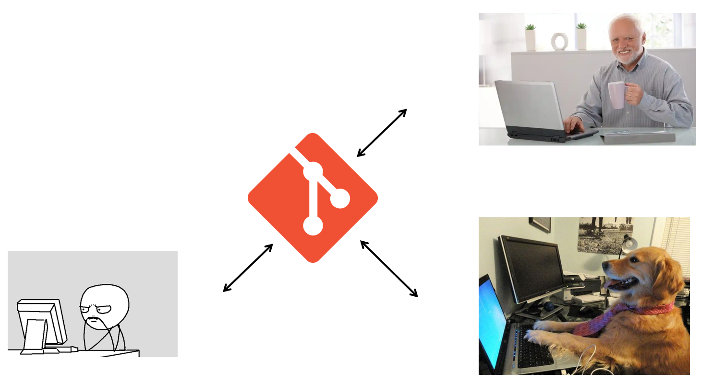

<!-- .slide: data-background="#003d73" -->
## EF Core - Tips and Tricks


  <!-- .element style="width: 300px;" -->


----

### Agenda
* Migrations - When working in a team
    * Limiting the number of migrations
    * Handling git conflicts
  
* Data Tranfer Object (DTO)
    * Why do i need them?
    * How to make them less troublesome to work with
        * Swagger
        * Automapper

----

### Agenda 

* Entity Configuration
    * Split the context file

* Advanced Data Structure 
    * Base model
    * Overriding Ef Core SaveChanges()
        * Soft delete
        * Meta data

----

### Agenda

* Advanced Data Access Layer (DAL)
    * Base data manager class
    * Performance.
        * Custom Queries
        * Performing logic in queries
        * AsNoTracking (When and why)
    * Context Tricks

---


## Migrations 

When working in a team

  <!-- .element style="width: 800px;" -->
----

### Limiting the number of migrations

* Think ahead (If possible)
* Squash before merging your feature

----

### Handling git conflicts

* Merge conflicts in the Snapshot file
* How to handle the conflict?
    1. Abort the merge
    2. Rollback the migration on the destination branch
    3. Commit the rollback to git
    4. Merge the two branches and apply your migration again
---


## Data Transfer Object (DTO)

* Why do i need them?
  * Control data sent to a frontend application or a third party api
  * Combine data from multiple tables
  * Simplify and minimize the transfered data

----

### Tools - Swagger
 * Auto generated data models for your frontend application


```text
nswag openapi2tsclient /input:http://localhost:6220/swagger/v1/swagger.json /output:api-clients.ts
```
<!-- .element style="font-size: 16px;" -->

----

### Tools - Automapper
* Convert EF Core models to DTO's with minimal effort.

 ```csharp 
 public class UserProfile : Profile
{
    public UserProfile()
    {
        CreateMap<UserDto, User>()
            .ReverseMap();

        CreateMap<User, CreateUserDto>()
            .ReverseMap();
    }
}
  ```

---

## Entity Configuration
* Annotation vs Fluent API
  * Why we use Fluent API

* Large database context files 
----

### Split the context file
Separate configuration files. <!-- .element style="text-align: left;" -->

```csharp
public class UserConfig : IEntityTypeConfiguration<User>
{
    public void Configure(EntityTypeBuilder<User> builder)
    {
        builder.Property(u => u.Role)
            .HasConversion(
                v => v.ToString(),
                v => (UserRole)Enum.Parse(typeof(UserRole), v));
    }
}
```

---

## Advanced Data Structure
* Why?
  * Less scaffolding
  * Resusable code
  * Meta data

<!-- .element style="display: flex;" -->
----

## Base model

A base class which contains properties common for EF Core models. <!-- .element style="font-size: 24px;" -->
```csharp
public abstract class ModelBase : IModelBase
{
    public int Id { get; set; }
    public DateTimeOffset? CreatedOn { get; set; }
    public DateTimeOffset? ModifiedOn { get; set; }
    public string CreatedBy { get; set; }
    public string UpdatedBy { get; set; }
    public bool IsDeleted { get; set; }
}
```
----

## Overriding SaveChanges()

Setting the meta data values automatically based on the relevant operation <!-- .element style="font-size: 24px;" -->

Let's look at some code!

---

## Advanced Data Acces Layer (DAL)

----

### Base data manager class
To aid in developing new domains with less effort and time we can extract basic functionality into a base class with a generic type.

Code demo
----

### Context tricks
Context.Attach <!-- .element style="text-align: left;" -->

```csharp
 _context.Attach(entity);
```
<!-- .element style="font-size: 16px;" -->

Entry.State <!-- .element style="text-align: left;" -->

```csharp
_context.Entry(entity).State = EntityState.Modified;
```

<!-- .element style="font-size: 16px;" -->
----

### Performance tricks
* Custom Queries
* Performing logic in queries
* AsNoTracking (When and why)
