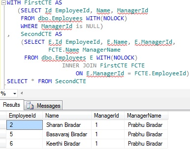
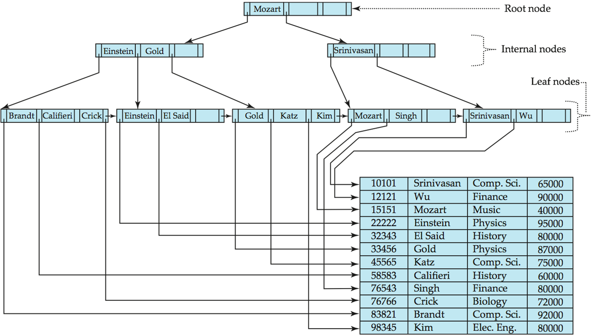
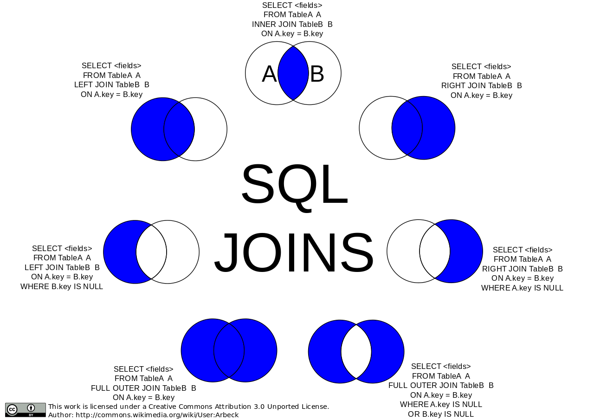
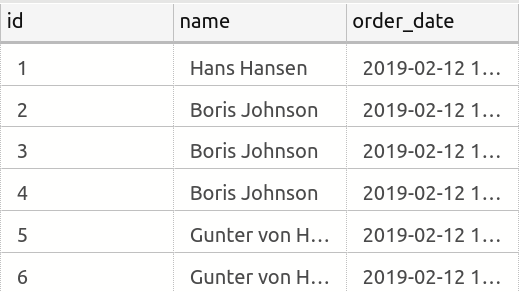
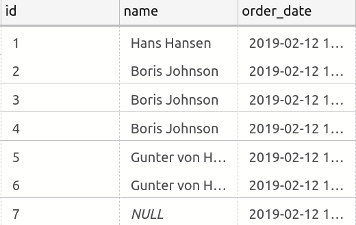
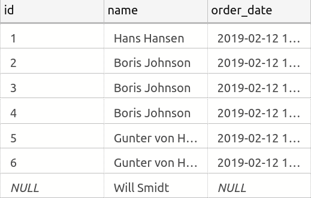
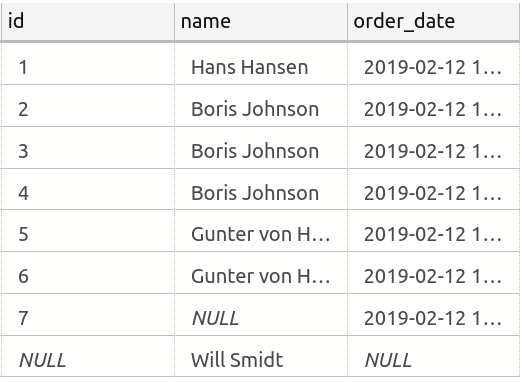
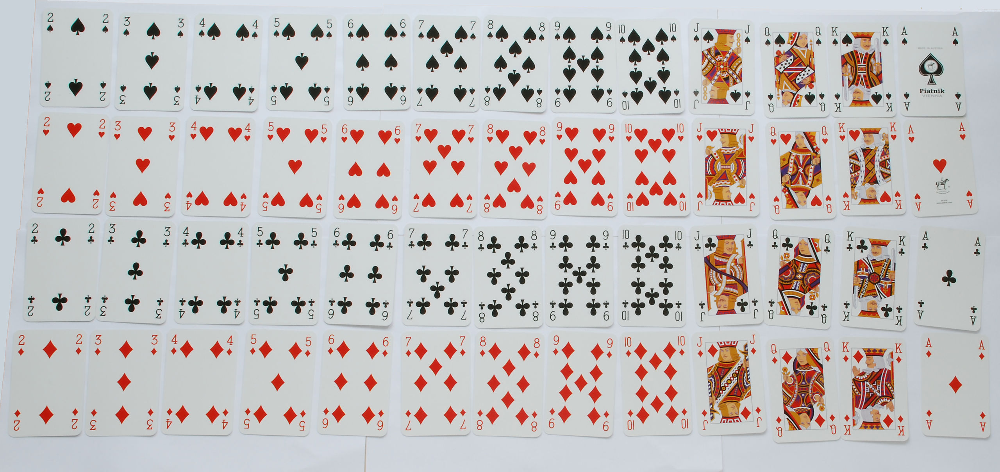

<!-- .slide: data-background="#003d73" -->

## SQL + DML Advanced



 <!-- .element style="width: 200px; position: fixed; bottom: 50px; left: 50px" -->


----

### Agenda

* Queries
    * Sub-queries
* Transactions
* Join
* Views

---

### ORDER BY/GROUP BY

```sql
SELECT * FROM movies 
  ORDER BY title [DESC|ASC]
--
SELECT studioName,count(title) FROM movies
  GROUP BY studioName
```

* HAVING  can be used for search condition when using **GROUP BY**

```sql
HAVING count(title) >= 2
```

----

### Indexes

* Do not require uniqueness
* Used to quickly locate rows
* Defines a data structure saved on disk, along with data

```sql
CREATE TABLE dbo.Employee (
  EmployeeId INT PRIMARY KEY,
  LastName VARCHAR(50), FirstName VARCHAR(50),

  DepartmentId INT, StartDate DATETIME)

```

* *Remember*: primary key requires value(s) to be not-null and key should uniquely point to row

----



---

### TOP

```sql
SELECT TOP 10 * FROM movies
  ORDER BY length
-- or
SELECT TOP 50 PERCENT * FROM movies
```

----

### Pagination

```sql
SELECT * FROM Sales.SalesOrderDetail 
  ORDER BY ModifiedDate, SalesOrderDetailID
```

```sql
SELECT * FROM Sales.SalesOrderDetail 
  ORDER BY ModifiedDate, SalesOrderDetailID
  OFFSET 3 ROWS
  FETCH NEXT 3 ROWS ONLY
```


----

### Search condition

* Equal

```sql
SELECT * FROM movies
  WHERE title = ('Star Wars')
```

* LIKE

```sql
SELECT * FROM movies
  WHERE title LIKE ('Star %')
```

----

### Search condition - 2

* IN

```sql
SELECT * FROM movies WHERE genre
  IN ('Comedy')
```

* BETWEEN

```sql
SELECT * FROM movies WHERE year
  BETWEEN 1920 AND 1940
```

----

#### CASE 1/3

| title        | ... | drama | scify | comedy | cartoon | ... | category |
|--------------|-----|-------|-------|--------|---------|-----|----------|
| Star Wars    |     | T     | T     | F      | F       |     | null     |
| Monsters Inc |     | F     | F     | T      | T       |     | null     |
| Casablanca   |     | T     | F     | F      | F       |     | null     |
<!-- .element: style="font-size: 32px" -->

----

#### CASE 2/3

How to calculate category?

```sql [1,2,3,4]
UPDATE movies SET category = 'drama' WHERE drama = 'T'
UPDATE movies SET category = 'scifi' WHERE scifi = 'T'
UPDATE movies SET category = 'comedy' WHERE comedy = 'T'
UPDATE movies SET category = 'cartoon' WHERE cartoon = 'T'
```

----

#### CASE 2/2

```sql
UPDATE movies SET category =
  CASE
    WHEN drama = 'T'    THEN 'drama'
    WHEN scifi = 'T'    THEN 'scifi'
    WHEN comedy = 'T'   THEN 'comedy'
    WHEN cartoon = 'T'  THEN 'cartoon'
    ELSE 'unknown'
  END
```

----

#### Aggregates

```sql
SELECT MIN(year) FROM movies
SELECT MAX(year) FROM movies
SELECT COUNT(*) FROM movies
SELECT AVG(rating) FROM movies
SELECT SUM(rating) FROM movies
SELECT DISTINCT(title) FROM movies
```

----

### Sub-queries

```sql
SELECT m.title, m.avgRating,
    (SELECT COUNT(r.id) FROM ratings AS r
       WHERE m.id = r.MovieId) AS numRatings
  FROM movies AS m
-- or
SELECT m.title FROM movies AS m
   WHERE m.id IN 
   (SELECT r.movieID FROM rating AS r)
```

----

### Transaction

* Treat multiple statements as single unit of work
* If transaction is successful
    * all changes are committed,
    * **else** all changes are canceled
* Autocommit - each statement is a transaction
* Explicit - started with BEGIN, ended explicitly
* Implicit - started when previous transaction completes and explicitly ended.

----

### An example

```sql
BEGIN TRY
BEGIN TRANSACTION
    UPDATE Account SET balance = balance + 100
       WHERE accNo = 123
    UPDATE Account SET balance = balance - 100
       WHERE accNo = 321
    -- RAISERROR('Some Random Error',16,1)
    COMMIT
END TRY
BEGIN CATCH
    ROLLBACK
END CATCH
```

----

### When to use transactions

```sql
BEGIN TRANSACTION
  UPDATE Account SET balance = balance + 100
    WHERE accNo = 123
  UPDATE Account SET balance = balance - 100
    WHERE accNo = 321
COMMIT
```

TODO: Rollback example <!-- .element: style="visibility: hidden" -->

----

### Explicit rollback

```sql
ROLLBACK TRANSACTION
```

* Can have names and descriptions
* Can be nested

```csharp
try {
  conn.Open();
  SqlTransaction tran = conn.BeginTransaction();
  ...
} catch (Exception e) {
  tran.Rollback();
}
```

---

## Joins


<!-- .element style="width: 800px; " -->

----

### Documentation

Again :(

```sql
<joined_table> ::=   
{  
    <table_source> <join_type> <table_source> ON <search_condition>   
    | <table_source> CROSS JOIN <table_source>   
    | left_table_source { CROSS | OUTER } APPLY right_table_source   
    | [ ( ] <joined_table> [ ) ]   
}  
<join_type> ::=   
    [ { INNER | { { LEFT | RIGHT | FULL } [ OUTER ] } } [ <join_hint> ] ]  
    JOIN  
```
<!-- .element: style="font-size: 18px" -->


----

### Example tables

```sql
CREATE TABLE customer(
  id           INT PRIMARY KEY,
  name         NVARCHAR(255),
  country      NVARCHAR(255));
CREATE TABLE order_table(
  id           INT PRIMARY KEY,
  customer_id  INT,
  value        INT,
  order_date   DATETIME DEFAULT getdate());
INSERT INTO customer VALUES
 (1, 'Hans Hansen', 'Denmark'), (2, 'Boris Johnson', 'Great Britan'),
 (3, 'Gunter von Halden', 'Germany'), (5, 'Will Smidt', 'USA');
INSERT INTO order_table (id, value, customer_id) VALUES
 (1, 10, 1), (2, 20, 2), (3, 30, 2), (4, 24, 2),
 (5, 100, 3), (6, 14, 3), (7,12, 12);
```
<!-- .element: style="font-size: 22px" -->


----

### Inner join

* **JOIN** or **INNER JOIN**

```sql
SELECT o.id, c.name, o.order_date 
FROM order_table AS o
INNER JOIN customer AS c ON o.customer_id = c.id
```


 <!-- .element: class="fragment" style="position: absolute; bottom: -80px; right: -180px;" -->


----

### Left join

* Fetches data present in left table in combination with data from right table

```sql
SELECT o.id, c.name, o.order_date 
FROM order_table AS o
LEFT JOIN customer AS c ON o.customer_id = c.id
```


 <!-- .element: class="fragment" style="position: absolute; bottom: -80px; right: -180px;" -->


----

### Right join

* Fetches data present in right table in combination with data from left table

```sql
SELECT o.id, c.name, o.order_date 
FROM order_table AS o
RIGHT JOIN customer AS c ON o.customer_id = c.id
```


 <!-- .element: class="fragment" style="position: absolute; bottom: -80px; right: -180px;" -->

----

### Full join

* Fetches data from both tables

```sql
SELECT o.id, c.name, o.order_date 
FROM order_table AS o
FULL JOIN customer AS c ON o.customer_id = c.id
```


 <!-- .element: class="fragment" style="position: absolute; bottom: -80px; right: -180px;" -->

----

### Cross join

* [Cartesian Product](https://en.wikipedia.org/wiki/Cartesian_product "https://en.wikipedia.org/wiki/Cartesian_product")

`$$ \mathbb{A} \times \mathbb{B} = \lbrace (a, b) | a \in \mathbb{A}, b \in \mathbb{B} \rbrace $$`
`$$ \lbrace \mathrm{A}, \mathrm{K}, \mathrm{Q}, \mathrm{J}, 10, 9, 8, 7, 6, 5, 4, 3, 2\rbrace $$`
`$$ \lbrace \heartsuit, \spadesuit, \diamondsuit, \clubsuit\rbrace $$`

----



---

### Combining relations

* Commands:
    * INTERSECT
    * UNION
    * EXCEPT
* Creates a temporary relation
```sql
(SELECT ... FROM ... WHERE)
  INTERSECT | EXCEPT | UNION
(SELECT ... FROM ... WHERE)
```
* **Requires** output from tables to have same number and types


----


### Views

* Create a View

```sql
CREATE VIEW CostumerOrders AS
SELECT o.id, c.name, o.order_date 
FROM order_table AS o
LEFT JOIN customer AS c ON o.customer_id = c.id
```
* Using a view - like a table
```sql
SELECT * FROM CostumerOrders
```
* **Note**: Computed on every query

----


---

### Exercises


----

### References

* [B-tree](https://www.eandbsoftware.org/how-a-database-index-can-help-performance/)
* [Frontpage meme](http://www.developermemes.com/2013/03/27/sql-timing-out-so-raise-timeout/)
* [Join](https://www.cleanpng.com/png-join-microsoft-sql-server-table-oracle-database-6091970/)
* [Exercise gif](https://parentsneed.com/7-ways-to-help-make-homework-fun/)