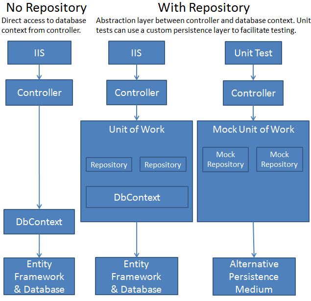

<!-- .slide: data-background="#003d73" -->
## EF Advanced


 <!-- .element style="width: 200px; position: fixed; bottom: 50px; left: 50px" -->

----

### Agenda

* EfCore Advanced
    * Existing database
    * Transactions
    * Disconnected Entities
    * Development
* Structure EfCore project
    * DDD: Entity + Repository
    * Unit of Work
    * QueryObjects
    * Object Mappers

---

## Existing database

* Reverse engineering a database through EF Core can be done with Scaffold tool
    * Visual Studio: 
    
    `> Scaffold-DbContext 'Data Source=127.0.0.1,1433; Database=Education;User ID=SA;Password=Password1;' Microsoft.EntityFrameworkCore.SqlServer
` <!-- .element style="font-size: 22px;" -->

**Note**: Connection string needs to point to the actual database you want to scaffold

Note:

1. Create project
2. Install Microsoft.EntityFrameworkCore.SqlServer and Microsoft.EntityFrameworkCore.Tools
3. Run above command with a correct Connection string

.Net Core CLI: 
`$ dotnet ef dbcontext scaffold "Data Source=(localdb)\MSSQLLocalDB;Initial Catalog=Chinook" Microsoft.EntityFrameworkCore.SqlServer` <!-- .element style="font-size: 22px;" -->

----

### When scaffold don't work

* Columns types not supported with EF Core
* Inheritance
* Tables without primary key

----

### Afterwards

* The model can be changed afterwards (with migrations) -> So inheritance etc. can be created manually afterwards
* Model is created as partial classes - so you can add extra validation

----

### Partial classes

```csharp
[ModelMetadataType(typeof(UserValidation))]
public partial class User {
  public string Email { get; set; }
}

private class UserValidation {
  [EmailAddress]
  public string Email { get; set; }       
}
```

----

### Scaffold options

* Skip tables with `-Tables` / `--tables`
* Preserving names from database `-UseDatabaseNames` / `--use-database-names`
* Fluent API is used by default to change to annotations `-DataAnnotations` / `--data-annotations`
* More configuration to be found in documentations


---

## Transactions

* All changes to be saved with SaveChanges() are applied in a single transaction

```csharp
public class AClass {
 public void AMethod() {
  using (var context = new MyDbContext()) {
   using (var transaction = context.Database.BeginTransaction()) {
     try {
       context.Books.Add(new Book { Title = "First Book" });
       context.SaveChanges();
       // .. Network call which Depends on First Book in DB and Second Book not
       context.Books.Add(new Book { Title = "Second Book" });
       context.SaveChanges();
 
       var books = context.Books.OrderBy(b => b.Title).ToList();
       // Commit transaction if all commands succeed, transaction will auto-rollback
       // when disposed if either commands fails
       transaction.Commit();
     }
     catch (Exception) { // TODO Handle failure
} } } } }
```
<!-- .element style="font-size: 16px;" -->

----

### When to use Transactions

* Business logic gets complex
* Solutions:

----

### 1. One big methods with all the logic

```csharp
public void OneMethodToRuleThemAll(MyContext context) {
    // Add
    // Update
    // Delete
    context.SaveChanges();
}
```

Problem: Obvious <!-- .element: class="fragment" -->

Note: 
Breaks SRP

Hard to reuse

----

### 2. Smaller methods which are called from overreaching method

```csharp
public void SaveAll() {
    SaveA();
    SaveB();
    SaveC();
    // Or call context.SaveChanges() instead
    // of each method
}

public void SaveA() {
    context.Add(new A() { ...});
    context.SaveChanges();
}
```

Problem: If later parts relies on earlier parts being written orm we forget to call SaveChanges <!-- .element: class="fragment" -->

----

### 3. Smaller methods and use transaction to run them as one

* Be aware that transactions can lock tables for writes (or reads) in some cases - so use with care

---

## Disconnected Entities

* Scenario: Changes are made in a different database context instance

 <!-- .element: style="height:200px" -->

----

### Update Disconnected Entities
* Determine if the entity exists in DB or not.
    * Auto-keys: use `context.Update(entity) // In Core 2.0+`
    * else: `context.Find(entity.Id) == null`
        * Use `context.Update(entity)`
        * Or `context.Add(newEntity)`
* Same for Graphs

----

### Delete Disconnected Entities

* Handling deletes
    * Harder since objects do not exists, so need check which do not exists in incoming
    * Can be handled with 'soft-deletes'

---

## Development

* From EF Core 2.1 the HasData method is added - part of OnModelCreating
* Migrations is created without connection to DB - have to specify ID manually.
* Data is removed if Primary key is changed

```csharp
public class Context: DbContext {
 public void CreateData(ModelBuilder modelBuilder) {
   modelBuilder.Entity<Book>().HasData(new Book() { Title = "A title", Isbn = 1 });
   modelBuilder.Entity<PriceOffer>().HasData(new PriceOffer{NewPrice = 1.1f, Isbn = 2});
   // Not working !
   // modelBuilder.Entity<Book>().OwnsMany(b => b.Reviews).HasData(
   //     new Review() { Id = 1, BookIsbn = 1, Votername = "V1", NumStars = 1},
   //     new Review() { Id = 2, BookIsbn = 2, Votername = "V2", NumStars = 2}
   // );
   modelBuilder.Entity<Review>().HasData(
       new Review() { Id = 2, BookIsbn = 2, Votername = "V2", NumStars = 2});
   modelBuilder.Entity<Review>().HasData(
       new { Id = 1, BookIsbn = 1, Votername = "V1", NumStars = 1});
} }
```
<!-- .element style="font-size: 16px;" -->

----

### Other solutions

* `InsertData()`, `UpdateData()`, `DeleteData()` on `MigrationBuilder`
    * [See Custom Migrations operations](https://docs.microsoft.com/en-us/ef/core/managing-schemas/migrations/operations)

----

#### Logging

* LogLevel.Information gives a list of all SQL commands generated by EF Core
* Setup log factory:

```csharp
public class AClass {
  public void Setup() {
    var logs = new List<String>();
    var loggerFactory = context.GetService<ILoggerFactory>();
    loggerFactory.AddProvider(new MyLoggerProvider(logs, LogLevel.Information));
  }
}
```

<!-- .element style="font-size: 16px;" -->

----

### Performance

* EF Core alerts to possible suboptimal LINQ commands by logging a warning of type QueryClientEvaluationWarning.
    * Sometimes EF Core can not translate LINQ expression to SQL
* Configure EF Core to throw an exception
* Analyse SQL queries
    * E.g. Azure Data studio execution plan

```
Run current Query with Actual Plan
```

----

### Keep your application performing

1. Use SELECT loading to load only needed data
2. Use paging/filtering to reduce rows loaded into application from SQL Server
3. Lazy loading will affect performance
4. Use `AsNoTracking` when you load read-only data
5. Using async versions when possible
6. Structure code, so database access code is isolated

---

## Testing

* Create AddDbContext constructor for testing, which allows for all options to come from test methods

```csharp
public class AppDbContext : DbContext {
  public AppDbContext() { }

  public AppDbContext(DbContextOptions<AppDbContext> options)
      : base(options) { }

  protected override void OnConfiguring(DbContextOptionsBuilder options)
  {
    if (!options.IsConfigured)
    {
      options.UseSqlServer("Data Source=....");
    }
  }
}
```


----

* Steps in test method
    1. Create connection to in-memory database
    2. Create DbContextOptions
    3. Initialize AppDbContext
    4. Insert test data
    5. Test business logic
    6. Close connections
    7. Cleanup

* `SQLite` in-memory database or `InMemory` for General purpose database


---

### Structuring EfCore apps

* Build on top of others work
* Faster development
* Less repetitive work
    * -> Fewer bugs
* Keep access to EfCore code in DAL
* Separation of Concerns
    * Each layer is responsible for one thing - mental model is easier
    * Having a isolated DAL is easier to test

----

### DDD

* From Domain-Driven Design by Eric Evans
    * About putting Business Domain in the center of Software
* DDD in short
    * A project consists of one or more bounded context
    * Within a Bounded context there exists an Ubiquitous Language around an Domain Model
    * Building Blocks
        * **Entity**, Value Object, **Aggregate**, **Repostory**, Domain Event, Service, Factory

----


----

#### DDD continued

* Entity is an object which is not defined by its attributes but by an ID
* Aggregates is a collection of entities
* Root entities is only way to access entities within an Aggregate
* Repository is exposing a set of methods for accessing domain objects (entities)

----


---

## Repository

* Exposes a set of methods that reflects UIL
* Data is changed through methods and not entities
    * ensures data is updated correctly
* Hides EF(Core) code  from application

```csharp
// Example repository methods
public void AddBook(Book book)
public Book FindBook(int Id)
public void DeleteBook(Book book)
public void UpdateBook(Book book)
public List<book> Books(ICriteria criteria)
// Book not has private setters
public void AddReview(Review review)
public void AddAuthor(Author authors)
...
```

Note:
https://docs.microsoft.com/en-us/dotnet/standard/microservices-architecture/microservice-ddd-cqrs-patterns/infrastructure-persistence-layer-implemenation-entity-framework-core#implement-custom-repositories-with-entity-framework-core

----



----

#### Considerations

* Use Repository to hide DAL from application
    * \+ Interchangeable DAL
    * % Can't use O/RM as efficient


---

## Unit Of Work

"Maintains a list of objects affected by a business transaction and coordinates the writing out of changes and the resolution of concurrency problems." - Martin Fowler

* The Unit of Work pattern is made to keep track of all changes made in database
    * Avoid changes that are not written

----

### UoW in EfCore

* Could see `DbContext` as Unit of Work
* but Microsoft 'recommends' to build a UnitOfWork + Repository pattern around `DbContext`
    * An abstraction between BLL and DAL
    * Easier to maintain and test
        * Changes from DAL effect BLL less

```cshap
public class UnitOfWork : IDisposable {
    private DbContext context = new DbContext();
    private GenericRepository<Book> bookRepository;
    public GenericRepository<Department> DepartmentRepository {
    // Return Singleton instance
    }
    public void Save() { context.SaveChanges(); }
    // TODO Implement Dispose()
}
```

Note: 
https://docs.microsoft.com/en-us/aspnet/mvc/overview/older-versions/getting-started-with-ef-5-using-mvc-4/implementing-the-repository-and-unit-of-work-patterns-in-an-asp-net-mvc-application

---

## Query Object

* "A Query Object is an interpreter [Gang of Four], that is, a structure of objects that can form itself into a SQL query."
* Makes it possible to create queries without knowing SQL and/or database schema.

----

### Example 

```csharp
public class BookQuery : IBookQuery {
    public bool LoadAuthor { get; set; } = false;
    public int? AuthorId { get; set; } = null;
    public async Task<IEnumerable<Book>> Execute(
            AppDBContext context) {
        if (AuthorId == null) {
        if (LoadAuthor) return await context.Set<Book>()
                    .Include(b=>.Author).ToListAsync();
        else return await context.Set<Book>().ToListAsync();
        } else return await context.Set<Book>()
            .Where(b =>b.AuthorId==(int)).ToListAsync();
} }
```

----

### Query Object cont.

* Another look on Query objects
    * https://www.rahulpnath.com/blog/query-object-pattern-and-entity-framework-making-readable-queries/
* Library for implementing Query Objects and/or repository. E.g.
    * https://github.com/urfnet/URF.NET

---

## Object Mappers

* Transform between Entity classes and DTOs
    * Typically one DTO per 'view'
    * Transformation is done in DI service
* Manually way to create LINQ transformation manually -> Time consuming
* 'Automatic' use a library that make use of 'IQueryable'

----

## Mapper Examples

* 'EF Core in action' recommends [https://github.com/Automapper/Automapper](AutoMapper)
* AutoMapper work with convention eg. convert PromotionNewPrice to Promotion.NewPrice since there are a navigational property Promotion

```csharp
var config = new MapperConfiguration(cfg => {
    cfg.CreateMap<Book, BookDto>();   
    cfg.CreateMap<Review, ReviewDto>();
});
using (var context = new AppDbContext())
{
    var result = context.Books.  
        ProjectTo<BookDto>(config)
        .ToList();
}
```


---

## Exercises :)

<!-- .slide: data-background="./img/make-homework-fun.jpg" -->

----

## References